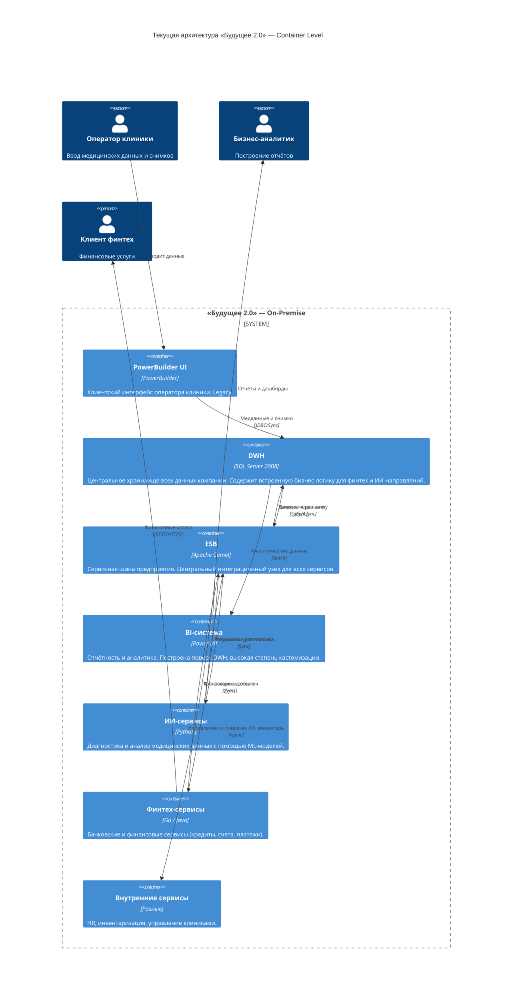
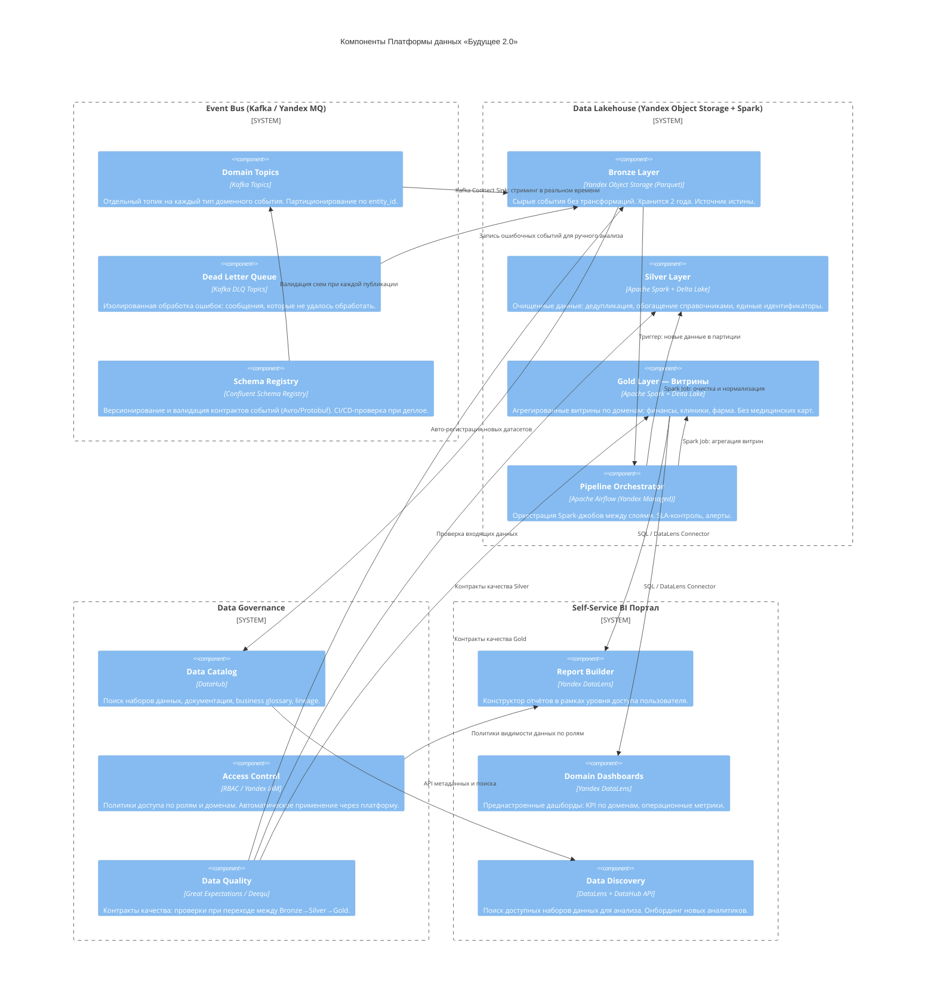

# C4-диаграмма — «Будущее 2.0»

Диаграммы описывают трёхлетнюю эволюцию архитектуры: от монолитного DWH + ESB к слабосвязанной событийной платформе с Data Mesh.

---

## 1. AS-IS: Текущее состояние (Container Level)

**Ключевые проблемы AS-IS:**
- SQL Server 2008 — снят с поддержки, является единой точкой отказа и хранит всю бизнес-логику
- ESB (Camel) — синхронный «паук», создающий жёсткую связанность всех сервисов
- Batch-отчётность: сложные запросы к DWH занимают часы, нет near-real-time
- PowerBuilder UI — невозможно масштабировать и интегрировать новые направления
- Нет разделения доменов: финтех, медицина и аналитика перемешаны в одной БД

---

## 2. TO-BE: Целевое состояние через 3 года (Container Level)

```mermaid
C4Container
  title Целевая архитектура «Будущее 2.0» — Container Level (горизонт 3 года)

  Person(operator, "Оператор клиники", "Работает с медсистемой")
  Person(analyst, "Бизнес-аналитик", "Self-service BI без зависимости от IT")
  Person(fintech_user, "Клиент финтех / банк", "Финансовые услуги")
  Person(pharma_partner, "Партнёр фарма", "Данные о препаратах и поставках")
  Person(medtech_partner, "Партнёр медоборудование", "IoT-данные оборудования")

  System_Boundary(cloud, "Yandex Cloud — «Будущее 2.0»") {

    Container(api_gw, "API Gateway / IAM", "Yandex API Gateway + Identity Center", "Единая точка входа. Аутентификация, авторизация, rate limiting.")

    System_Boundary(healthcare_domain, "Домен: Здравоохранение") {
      Container(med_services, "Медицинские сервисы", "Go / Java (микросервисы)", "Управление клиниками, пациентами, расписанием, медкартами.")
      Container(medical_db, "Medical DB", "Yandex Managed PostgreSQL", "Медицинские карты, истории болезни. Не входит в аналитику.")
    }

    System_Boundary(fintech_domain, "Домен: Финтех / Банк") {
      Container(banking_services, "Банковские сервисы", "Go / Java", "Кредиты, счета, платежи. Банковская лицензия.")
      Container(fintech_db, "Fintech DB", "Yandex Managed PostgreSQL", "Финансовые данные домена.")
    }

    System_Boundary(pharma_domain, "Домен: Фарма (новый)") {
      Container(pharma_services, "Фарма-сервисы", "Go / Python", "Интеграция с фармацевтическими партнёрами, управление препаратами.")
      Container(pharma_db, "Pharma DB", "Yandex Managed PostgreSQL", "Данные о препаратах, рецептах, поставках.")
    }

    System_Boundary(medtech_domain, "Домен: МедТех (новый)") {
      Container(medtech_services, "МедТех-сервисы", "Go / Python", "Интеграция с производителем медоборудования, IoT-метрики.")
      Container(medtech_db, "MedTech DB", "Yandex Managed PostgreSQL / TimeSeries", "Данные оборудования, телеметрия.")
    }

    System_Boundary(ai_domain, "Домен: ИИ-платформа") {
      Container(ai_platform, "ИИ-сервисы", "Python / MLOps", "Диагностика, предиктивная аналитика. Работает только с медданными.")
      Container(model_registry, "Model Registry", "Yandex DataSphere / MLflow", "Обучение, версионирование и деплой ML-моделей.")
    }

    System_Boundary(data_platform, "Платформа данных (Data Mesh)") {
      Container(event_bus, "Event Bus", "Apache Kafka / Yandex Message Queue", "Асинхронный обмен доменными событиями. DLQ, Schema Registry.")
      Container(data_lakehouse, "Data Lakehouse", "Yandex Object Storage + Apache Spark + Delta Lake", "Bronze/Silver/Gold слои. Витрины данных по доменам.")
      Container(data_catalog, "Data Catalog", "DataHub", "Каталог данных: поиск, lineage, документация, RBAC.")
      Container(self_service_bi, "Self-Service BI Портал", "Yandex DataLens", "Конструктор отчётов и дашбордов для бизнес-пользователей.")
    }

    System_Boundary(migration_layer, "Слой совместимости (до 18 мес., затем выводится)") {
      Container(legacy_dwh, "Legacy DWH Bridge", "SQL Server → read-only replica", "Антикоррупционный слой. Только чтение. CDC для выгрузки исторических данных.")
      Container(camel_adapter, "Camel Compatibility Adapter", "Apache Camel", "Адаптер для интеграций, не перешедших на события. Выводится после миграции.")
    }
  }

  Rel(operator, api_gw, "HTTPS")
  Rel(fintech_user, api_gw, "HTTPS")
  Rel(pharma_partner, api_gw, "HTTPS")
  Rel(medtech_partner, api_gw, "HTTPS")
  Rel(analyst, self_service_bi, "Строит отчёты и дашборды")

  Rel(api_gw, med_services, "REST / gRPC")
  Rel(api_gw, banking_services, "REST / gRPC")
  Rel(api_gw, pharma_services, "REST / gRPC")
  Rel(api_gw, medtech_services, "REST / gRPC")

  Rel(med_services, event_bus, "PatientAdmitted, DiagnosisCompleted, AppointmentBooked")
  Rel(banking_services, event_bus, "LoanGranted, PaymentProcessed, AccountOpened")
  Rel(pharma_services, event_bus, "OrderCreated, DeliveryConfirmed, PrescriptionIssued")
  Rel(medtech_services, event_bus, "DeviceAlert, MaintenanceScheduled, ReadingRecorded")

  Rel(event_bus, data_lakehouse, "Kafka Connect Sink: стриминг событий в Bronze слой")
  Rel(event_bus, ai_platform, "Медицинские события для ИИ-диагностики")
  Rel(data_lakehouse, self_service_bi, "Gold Layer: аналитические витрины (без медкарт)")
  Rel(data_lakehouse, data_catalog, "Авто-регистрация метаданных и lineage")
  Rel(data_catalog, self_service_bi, "Обнаружение доступных наборов данных")

  Rel(legacy_dwh, event_bus, "CDC: исторические данные при миграции (Yandex Data Transfer)")
  Rel(camel_adapter, event_bus, "Адаптация legacy-интеграций в события")
```

**Ключевые изменения TO-BE:**
- PowerBuilder UI → **выведен из эксплуатации** (Retire), заменён микросервисными интерфейсами
- DWH SQL Server 2008 → **антикоррупционный слой на 18 мес., затем Retire**; данные мигрируют в доменные БД и Lakehouse
- ESB Camel → **сохраняется только как адаптер совместимости** до завершения миграции
- Power BI → **заменён Self-Service BI** порталом (Yandex DataLens) с Data Catalog
- Добавлены два новых домена: Фарма и МедТех

---

## 3. TO-BE: Компонентная диаграмма — Платформа данных (Component Level)

---

## Этапы трансформации

| Этап | Период | Ключевые изменения |
|------|--------|--------------------|
| Пилот | 0–6 мес. | Пилот в доменах Финтех + Пациентский поток. Event Bus, Schema Registry, DLQ. Каталог схем. |
| Масштабирование | 6–18 мес. | Все критические домены на событиях. Стриминговые витрины. Антикоррупционные слои для Camel/DWH. Два новых домена (Фарма, МедТех). |
| Финальный | 18–36 мес. | Вывод DWH и ESB из эксплуатации. Доменная аналитика на потоках. Self-Service BI для всех бизнес-пользователей. |
