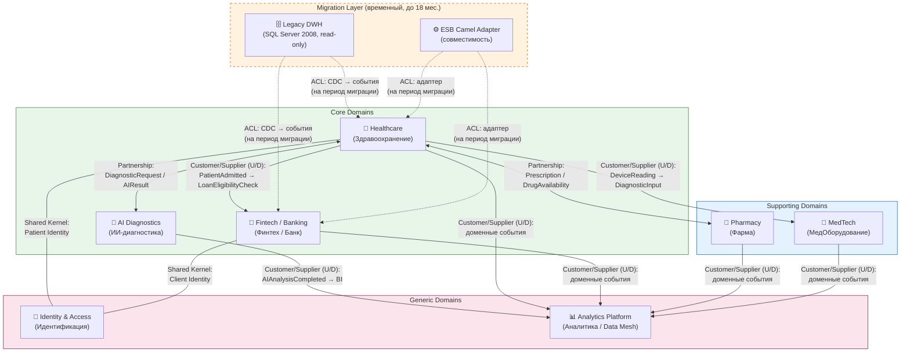

# Bounded Contexts — «Будущее 2.0»

---

## Классификация доменов

| Тип | Домен | Обоснование |
|-----|-------|-------------|
| **Core** (ядро бизнеса) | Healthcare, Fintech/Banking, AI Diagnostics | Прямая конкурентная ценность компании |
| **Supporting** (поддерживающий) | Pharmacy, MedTech | Важны для продукта, но не уникальны |
| **Generic** (общий) | Identity & Access, Analytics Platform | Инфраструктура, одинаковая для всех |

---

## Карта контекстов (Context Map)

**Типы отношений:**
- **Shared Kernel** — общая модель `Person` / `Identity` между Healthcare и Fintech (один человек = пациент = клиент банка)
- **Partnership** — двусторонняя зависимость, команды согласуют изменения совместно
- **Customer/Supplier (U→D)** — upstream-домен публикует события, downstream подписывается без обратного влияния
- **ACL (Anti-Corruption Layer)** — адаптер защищает новые домены от Legacy-модели; существует только на этапе миграции

---

## Описание bounded contexts

### 1. Healthcare — Здравоохранение

**Ответственность:** управление клиниками, пациентами, расписанием, медицинскими картами и историями болезни.

**Включает sub-contexts:**

| Sub-context | Ответственность |
|-------------|-----------------|
| Patient Management | Регистрация, идентификация, история болезни пациента |
| Clinic Operations | Расписание приёмов, госпитализация, выписка |
| Medical Records | Диагнозы, назначения лечения, результаты исследований |

**Граница:** медицинские карты и истории болезни **не передаются** в Analytics Platform — только агрегированные метрики (без персональных данных).

**Команда-владелец:** команда клиник + медицинский директор как Data Product Owner.

---

### 2. Fintech / Banking — Финтех / Банк

**Ответственность:** банковские услуги (кредиты, счета, платежи) в рамках банковской лицензии.

**Включает sub-contexts:**

| Sub-context | Ответственность |
|-------------|-----------------|
| Lending | Кредитные заявки, договоры, графики погашения |
| Accounts | Открытие/закрытие счетов, выписки |
| Payments | Инициация и обработка платежей |

**Граница:** финансовые данные клиента хранятся только в домене Fintech. Другие домены получают только события (факты) — без прямого доступа к БД.

**Команда-владелец:** команда финтех-сервисов + Fintech Data Product Owner.

---

### 3. AI Diagnostics — ИИ-диагностика

**Ответственность:** ML-модели для медицинской диагностики, анализ снимков и данных исследований.

**Включает sub-contexts:**

| Sub-context | Ответственность |
|-------------|-----------------|
| Diagnostic Requests | Приём запросов на анализ от Healthcare |
| Analysis Execution | Запуск моделей, версионирование, результаты |
| Model Registry | Управление жизненным циклом ML-моделей |

**Граница:** получает медицинские данные только от Healthcare через выделенный Event Bus-топик. Результаты анализа возвращаются через события — никогда через прямой вызов.

---

### 4. Pharmacy — Фарма (новый домен)

**Ответственность:** интеграция с фармацевтическими партнёрами, управление рецептами и поставками.

| Sub-context | Ответственность |
|-------------|-----------------|
| Prescriptions | Выписка рецептов врачами, передача в аптеки |
| Drug Catalog | Справочник препаратов, наличие, цены |
| Supply Chain | Заказы на поставку, логистика |

---

### 5. MedTech — Медицинское оборудование (новый домен)

**Ответственность:** интеграция с производителем оборудования, IoT-телеметрия, обслуживание.

| Sub-context | Ответственность |
|-------------|-----------------|
| Device Management | Реестр оборудования, технические паспорта |
| Telemetry | IoT-метрики, показания приборов в реальном времени |
| Maintenance | Регламентное и внеплановое обслуживание |

---

### 6. Identity & Access — Идентификация (Shared Kernel)

**Ответственность:** единый реестр личностей (пациент = клиент банка = сотрудник). Используется Healthcare и Fintech как Shared Kernel.

**Ключевое решение:** `person_id` — единый идентификатор, связывающий медицинский профиль и финансовый профиль одного человека. Изменения в модели согласуются обеими командами.

---

### 7. Analytics Platform — Платформа аналитики (Generic)

**Ответственность:** Data Lakehouse, Self-Service BI, Data Catalog, витрины данных.

Потребляет события из всех доменов. Не является источником событий. Предоставляет отчётность только из агрегированных данных без медицинских карт.
