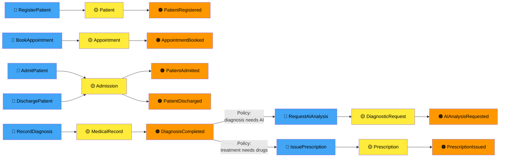
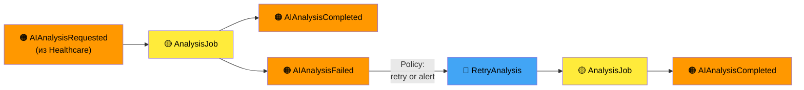
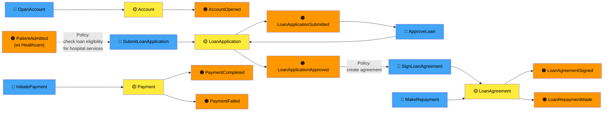
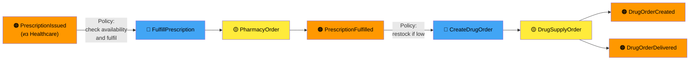
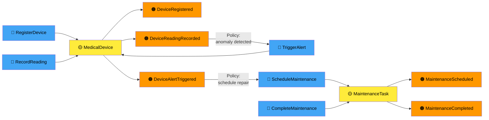
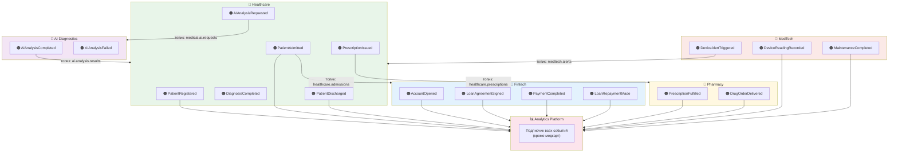

# Event Storming — «Будущее 2.0»

Диаграмма отражает целевую событийную архитектуру. Нотация:
- 🟠 **Событие** (Domain Event) — произошедший факт
- 🔵 **Команда** (Command) — намерение изменить состояние
- 🟡 **Агрегат** (Aggregate) — объект, обрабатывающий команду и порождающий событие
- 🟣 **Политика** (Policy) — реакция одного домена на событие другого
- 🔴 **Внешняя система** — Legacy DWH, партнёры

---

## 1. Домен: Healthcare

---

## 2. Домен: AI Diagnostics

---

## 3. Домен: Fintech / Banking

---

## 4. Домен: Pharmacy

---

## 5. Домен: MedTech

---

## 6. Сводная схема кросс-доменных взаимодействий

---

## Матрица подписок (кросс-доменные события)

| Событие | Источник | Подписчики | Семантика |
|---------|----------|------------|-----------|
| PatientRegistered | Healthcare | Analytics | Новый пациент в системе |
| PatientAdmitted | Healthcare | Fintech, Analytics | Госпитализация — триггер для проверки финансового покрытия |
| DiagnosisCompleted | Healthcare | Analytics | Факт постановки диагноза |
| AIAnalysisRequested | Healthcare | AI Diagnostics | Запрос на ML-анализ мед. данных |
| AIAnalysisCompleted | AI Diagnostics | Healthcare, Analytics | Результат ML-диагностики |
| PrescriptionIssued | Healthcare | Pharmacy, Analytics | Выписанный рецепт передаётся в аптеку |
| PatientDischarged | Healthcare | Analytics | Закрытие эпизода лечения |
| LoanAgreementSigned | Fintech | Analytics | Кредитный договор оформлен |
| PaymentCompleted | Fintech | Analytics | Платёж проведён успешно |
| PrescriptionFulfilled | Pharmacy | Analytics | Рецепт отпущен пациенту |
| DeviceAlertTriggered | MedTech | Healthcare, Analytics | Аварийный сигнал оборудования → уведомление клиники |
| DeviceReadingRecorded | MedTech | Analytics | Показания для аналитики |
