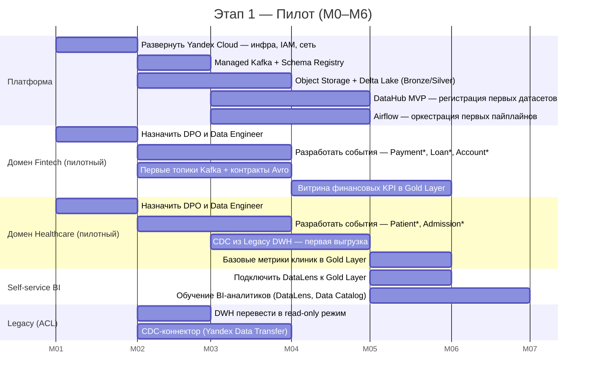
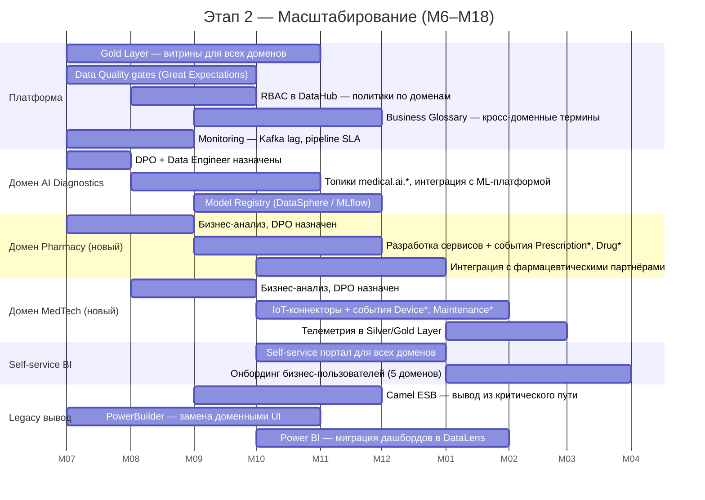
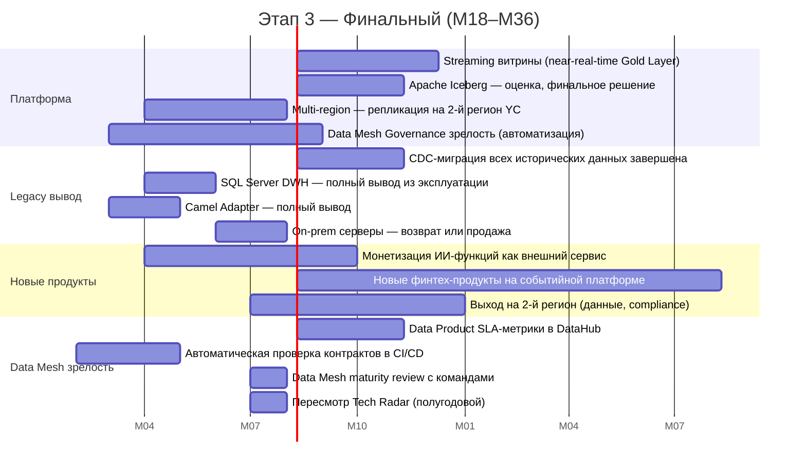
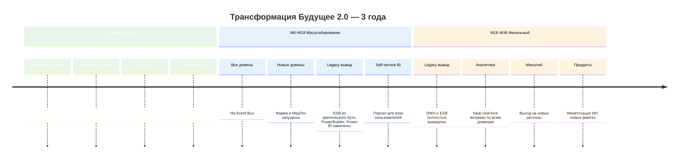

# Стратегический роадмап Data Mesh — «Будущее 2.0»

---

## Ключевые роли

| Роль | Ответственность | Где сидит |
|------|-----------------|-----------|
| **Data Product Owner (DPO)** | Определяет ценность данных домена, SLA на качество, доступность и документацию. Принимает решение о публикации нового Data Product. | В доменной команде |
| **Data Engineer** | Строит и поддерживает пайплайны: Event Bus → Bronze → Silver → Gold. Пишет качество-контракты, управляет схемами событий. | В доменной команде |
| **Platform Engineer** | Поддерживает общую Data Platform (Kafka, Spark, Object Storage, DataHub, Airflow). Обеспечивает self-service инструменты для доменных команд. | Платформенная команда |
| **BI-аналитик** | Строит аналитические витрины, дашборды и отчёты в DataLens. Консультирует бизнес по интерпретации данных. | В доменной команде или централизованно |
| **Data Governance Lead** | Формирует стандарты, политики, Business Glossary. Контролирует соблюдение compliance (152-ФЗ, ЦБ). | Платформенная команда / CDO |
| **Архитектор данных** | Проектирует контракты событий, Bounded Context Map, ADR. Контролирует эволюцию Schema Registry. | Платформенная команда |

---

## Этапы внедрения

### Этап 1: Пилот (Месяцы 0–6)

**Цель:** Доказать ценность Event-Driven + Data Mesh на двух доменах. Сформировать общую платформу и стандарты.

**Deliverables к концу М6:**
- Работающий Event Bus с 2 пилотными доменами
- Lakehouse Bronze/Silver/Gold с первыми витринами
- DataHub с каталогом первых Data Products
- DWH переведён в read-only
- 2 Data Product Owner назначены и прошли обучение
- Первые дашборды в DataLens для бизнес-пользователей

**Бизнес-цели этапа:**
- Продемонстрировать near-real-time отчётность по финансовым KPI (vs overnight batch)
- Снизить нагрузку на DBA за счёт вывода первых запросов из DWH

---

### Этап 2: Масштабирование (Месяцы 6–18)

**Цель:** Распространить Data Mesh на все критические домены. Подключить новые домены (Фарма, МедТех). Вывести ESB из критического пути.

**Deliverables к концу М18:**
- Все 5 доменов работают через Event Bus
- ESB Camel — только Compatibility Adapter для остаточных интеграций
- PowerBuilder выведен из эксплуатации
- Power BI заменён DataLens
- DataHub с полным каталогом и Business Glossary
- Новые домены Фарма и МедТех запущены в production

**Бизнес-цели этапа:**
- Подключение новых партнёров (фарма, медоборудование) без изменений в DWH
- Self-service BI доступен для всех бизнес-пользователей
- Сокращение времени построения отчётов с часов до минут

---

### Этап 3: Поддержка доменов и финальный вывод Legacy (Месяцы 18–36)

**Цель:** Вывести DWH и ESB из эксплуатации. Перейти к доменной near-real-time аналитике. Масштабировать на новые регионы.

**Deliverables к концу М36:**
- DWH SQL Server 2008 — полностью выведен
- ESB Camel — полностью выведен
- On-premise инфраструктура — ликвидирована
- Near-real-time витрины по всем доменам
- 2–3 региона поддерживаются единой платформой
- Новые продукты (AI-as-a-service, новые финтех) запущены на событийной платформе

**Бизнес-цели этапа:**
- Монетизация ИИ как самостоятельного продукта
- Запуск в новых регионах без пропорционального роста IT-затрат
- Компания полностью Data Mesh по всем доменам

---

## Сводный таймлайн

---

## Привязка к бизнес-целям

| Бизнес-цель | Этап реализации | Ключевые роли | Архитектурные решения |
|-------------|-----------------|---------------|-----------------------|
| Портал самообслуживания для аналитиков | М6–М12 | BI-аналитик, DPO | Self-service BI (DataLens) + Gold Layer + DataHub |
| Интеграция новых партнёров (Фарма, МедТех) без DWH | М6–М18 | Data Engineer, DPO | Event Bus, новые bounded contexts |
| Near-real-time вместо batch overnight | М18–М24 | Platform Engineer | Streaming Gold Layer (Kafka → Spark Streaming) |
| Масштабирование на 2–3 региона | М24–М36 | Platform Engineer, Архитектор | Yandex Cloud multi-region, Data Catalog с регионами |
| Монетизация ИИ как продукта | М24–М36 | DPO AI-домена, Data Engineer | AI Diagnostics как внешний API, Model Registry |
| Запуск новых финтех-продуктов | М18–М36 | DPO Fintech, Data Engineer | Event-driven микросервисы на платформе |
